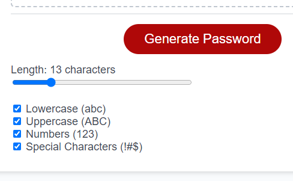

# Passwords Project

## Description

This web app creates randomly generated passwords based on user input.

## How to use

The website can be accessed at (benjstorlie.github.io/passwords)[https://benjstorlie.github.io/passwords/].  Press the big red "Generate Password" button to generate a password, and it will display in the central box.  Copy it to your favorite password manager.

## User Story

```
AS AN employee with access to sensitive data
I WANT to randomly generate a password that meets certain criteria
SO THAT I can create a strong password that provides greater security
```

## Acceptance Criteria

```
GIVEN I need a new, secure password
WHEN I click the button to generate a password
THEN I am presented with a series of prompts for password criteria
WHEN prompted for password criteria
THEN I select which criteria to include in the password
WHEN prompted for the length of the password
THEN I choose a length of at least 8 characters and no more than 128 characters
WHEN asked for character types to include in the password
THEN I confirm whether or not to include lowercase, uppercase, numeric, and/or special characters
WHEN I answer each prompt
THEN my input should be validated and at least one character type should be selected
WHEN all prompts are answered
THEN a password is generated that matches the selected criteria
WHEN the password is generated
THEN the password is either displayed in an alert or written to the page
```

## Screenshot

Here is a screenshot from Firefox, showing a pop-up dialog box using the `confirm` function, to ask a yes or no question.


I also included error messages.  The user is then immediately prompted to input again.


## Comments

1. I had first understood the the acceptance criteria to mean the typical prompts given when using a password generator, like this:

    

    Later, I clarified that the criteria were referring to the pop-up dialog boxes, for example using the `prompt` function.  I preserved my original web app by adding a small link to it at the top of the page, as a way to provide more options.

2. I made two different password generating functions: one that would not necessarily include every type of character selected, and one that would. The first was easier to create, but the second is more likely to be what someone is looking for in a password generator

    I suppose one way of making the second function from the first would be to check to see if it happened to make an inclusive password and, if not, generate another.

    I made the inclusive password generator by making the first few characters be of each selected character type, then randomly filling out the rest. After that, it shuffles and returns the result.
    
3. I wanted the length slider to be logarithmic (in the [no pop-ups version](https://benjstorlie.github.io/passwords/index-noPrompts.html)).  Since the length can vary from 8 to 128, but the user probably wants something less than 20, I wanted it to be easier to change to a particular length when the length is shorter.  That makes it so that the steps on the slider do not correspond to integer values anymore.  I set the `step` to `0.01`, since $\log_2 (128) - \log_2 (127) \approx 0.01$ and that would be the shortest difference, and then every possible integer length should be accessible.  However, it did not quite work when I tried it on my browser.  I have not yet tried it in too many browsers or changed the slider length too much at all.  There would have to be at least 400 pixels ($(7-3)/0.01$) available.  I did not want it to look too large, and I also suppose that someone is not going to care about the precise password length when it is that long.

4. In the future, I would like to change the display of the outputted password to color-code the types of characters.  This would make it easier for the user to distinguish `1` and `l` or `0` and `O`.  Since Space (U+0020) was included as a possible special character, I'd want it to display in a special way, especially if it is at the start or end of the password, or if there are more than one.  Honestly, I did not expect that Space was allowed, for that reason.

## Credits

1. [Mike Bostock: Fisher-Yates Shuffle](https://bost.ocks.org/mike/shuffle/)

    Since `shuffle` was not already a built-in method, I needed to code it in.  I copied the code from this article.  For more on the Fischer-Yates Shuffle, see the [Wikipedia article](https://en.wikipedia.org/wiki/Fisher%E2%80%93Yates_shuffle).

2. [OWASP Password Special Characters](https://owasp.org/www-community/password-special-characters)

    This is the website I got my list of special characters from.
